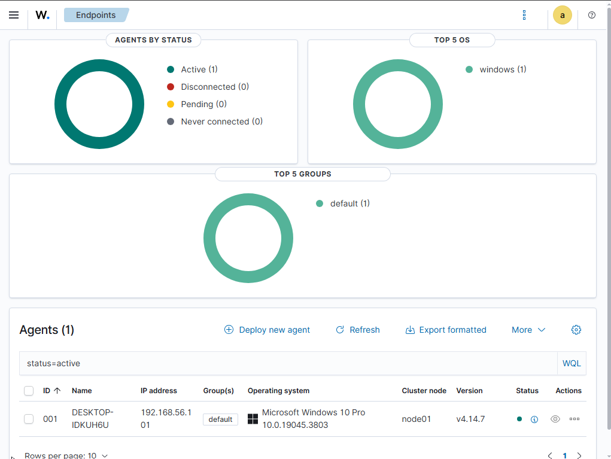
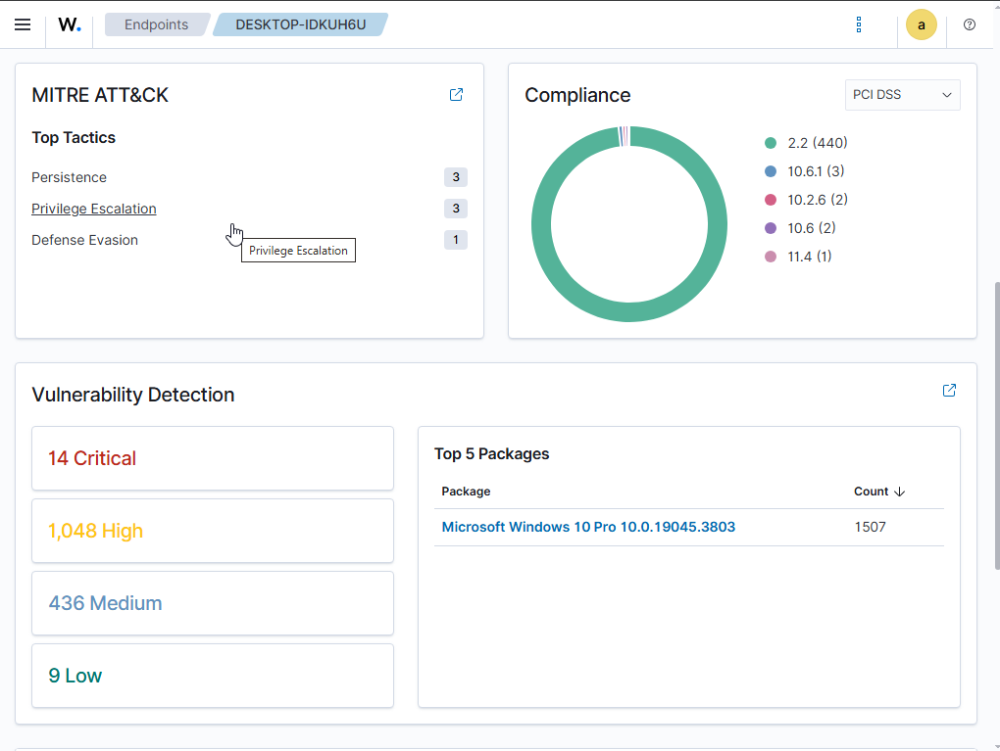
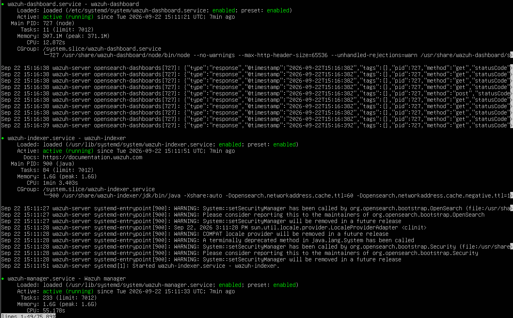

# SOC Simulation Lab – Enterprise Network Monitoring & Threat Detection

## Overview

A self-directed cybersecurity project implementing an isolated Security Operations Center (SOC) simulation environment using Wazuh, Windows, Ubuntu Server, Kali Linux, and VirtualBox.

The project demonstrates centralized security monitoring, endpoint telemetry collection, SIEM alert investigation, MITRE ATT&CK mapping, vulnerability visibility, and security reporting.

## Objectives

- Build an isolated virtual SOC environment
- Configure centralized security monitoring using Wazuh
- Monitor Windows endpoint security events
- Investigate SIEM alerts and related telemetry
- Map detected events to MITRE ATT&CK
- Analyze security and vulnerability information
- Generate security monitoring reports

## Lab Environment

| Component | Purpose |
|---|---|
| Wazuh | SIEM and security monitoring |
| Windows 10 | Monitored endpoint |
| Ubuntu Server | Wazuh server |
| Kali Linux | Security testing environment |
| VirtualBox | Virtualization platform |

## Monitoring Workflow

Event Generation → Log Collection → SIEM Detection → Alert Investigation → MITRE ATT&CK Mapping → Incident Documentation

## Technologies Used

- Wazuh
- Windows 10
- Ubuntu Server
- Kali Linux
- VirtualBox
- MITRE ATT&CK
- Sysmon
- Wireshark
- Networking and security monitoring tools

## Key Results

- Successfully connected and monitored a Windows endpoint using Wazuh
- Collected and analyzed security-related telemetry
- Investigated Wazuh alerts
- Viewed MITRE ATT&CK mappings and security tactics
- Reviewed vulnerability and compliance information
- Generated a MITRE ATT&CK security report

## Project Status

**Completed and documented**

This is a self-directed cybersecurity project developed for practical SOC and defensive security learning.

## Disclaimer

This project was developed in an isolated virtual lab environment for educational and defensive cybersecurity purposes.

## Lab Dashboards

### Wazuh Endpoints Dashboard

### Windows Agent Monitoring

### MITRE ATT&CK Dashboard

### Wazuh Server Services

## Lab Architecture & Components

| Component | Purpose / Role | OS / Software | Configuration Details |

| **Wazuh Server** | Centralized SIEM, log analysis, and threat detection | Ubuntu Server | Deployed in VirtualBox, collects telemetry and manages agents |
| **Monitored Endpoint** | Endpoint security monitoring, activity simulation | Windows 10 | Wazuh Agent connected via private lab IP (`192.168.56.101`) |
| **Security Testing Environment**| Simulating attacks and generating security alerts | Kali Linux | Isolated testing environment for validation |
